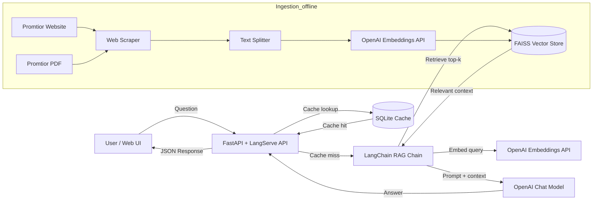

# Component Diagram — Promtior RAG Chatbot

Below is a high-level component diagram that shows the flow from user question to final answer.

Notes:
- The UI calls the custom `/promtior/ask` endpoint (cached), while LangServe exposes `/promtior/invoke` for direct chain access.
- The ingestion pipeline runs separately to build and persist the FAISS index.
